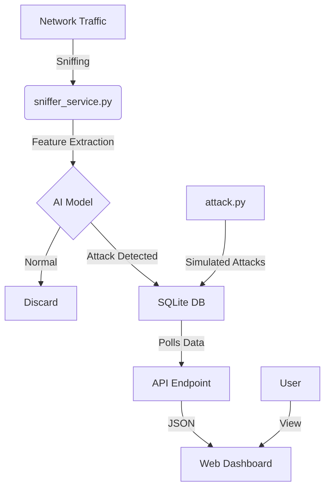

# Project Phoenix: Intelligent Cybersecurity IDS Analysis

## 1. Project Overview
**Phoenix** (CyberGuard AI) is a real-time Intelligent Intrusion Detection System (IDS) designed to protect network infrastructures by leveraging Machine Learning (XGBoost). Unlike traditional signature-based firewalls, it analyzes traffic behavior in real-time to detect sophisticated attacks such as DDoS, Port Scanning, Botnets, and Brute Force attempts.

## 2. System Architecture
The system follows a modular architecture consisting of three main layers: **Detection**, **Storage**, and **Visualization**.

## 3. Key Components Analysis

### A. Detection Engine (`sniffer_service.py`)
This is the core of the system. It runs in the background and monitors network traffic.
- **Library**: Uses `scapy` for packet capturing.
- **Workflow**:
    1.  **Sniffing**: Captures TCP/UDP packets.
    2.  **Flow Aggregation**: Groups packets into "flows" based on (Source IP, Dest IP, Source Port, Dest Port, Protocol).
    3.  **Feature Extraction**: Calculates statistical features (Flow Duration, Packet Lengths, Inter-Arrival Times, Flags) to match the **CICIDS2017** dataset format.
    4.  **Inference**:
        - Scales features using `scaler_final.pkl`.
        - Predicts using the pre-trained `xgboost_final.pkl` model.
    5.  **Logging**: If confidence is high and traffic is malicious, it logs the alert to `ids_logs.db`.

### B. The Brain (Machine Learning Models)
The system uses pre-trained serialized models:
- **`xgboost_final.pkl`**: The trained XGBoost classifier capable of distinguishing between Benign traffic and various attack families.
- **`scaler_final.pkl`**: Standard scaler to normalize input features.
- **`label_encoder_final.pkl`**: Decodes the numerical model output back into human-readable attack names (e.g., "DDoS", "PortScan").

### C. Backend & Visualization (`web_app.py`)
- **Framework**: FastAPI (Python).
- **Functionality**:
    - Serves the HTML Dashboard.
    - Provides a REST API (`/api/data`) that polls the SQLite database for the latest alerts and statistics.
- **UI**: Displays real-time metrics, a live threat feed, and attack distribution charts.

### D. Simulation Tool (`attack.py`)
A testing script used to verify the dashboard's responsiveness without generating real malicious traffic.
- Injects fake specific attack logs directly into the database to mimic an active threat scenario.

## 4. Workflows

### Real-Time Detection Flow
1.  Run `sniffer_service.py`.
2.  Packets are captured and buffered for 3 seconds.
3.  Features are computed and passed to the XGBoost model.
4.  Detected threats are committed to the database.

### Dashboard Monitoring Flow
1.  Run `web_app.py`.
2.  Frontend JavaScript periodically fetches `/api/data`.
3.  Dashboard updates the "Live Alert Feed" and "Threat Distribution" chart instantly.

## 5. Deployment Instructions
1.  **Install Dependencies**: `pip install -r requirements.txt`
2.  **Start Detection**: `python sniffer_service.py` (requires sudo for sniffing).
3.  **Start Dashboard**: `python web_app.py`
4.  **Access**: Open `http://localhost:8000`

## 6. Conclusion
Project Phoenix provides a robust foundation for a modern SOC tool, combining the speed of Scapy for sniffing with the accuracy of XGBoost for detection. Its decoupled architecture allows for easy scaling (e.g., replacing SQLite with PostgreSQL or moving the dashboard to a separate server).
