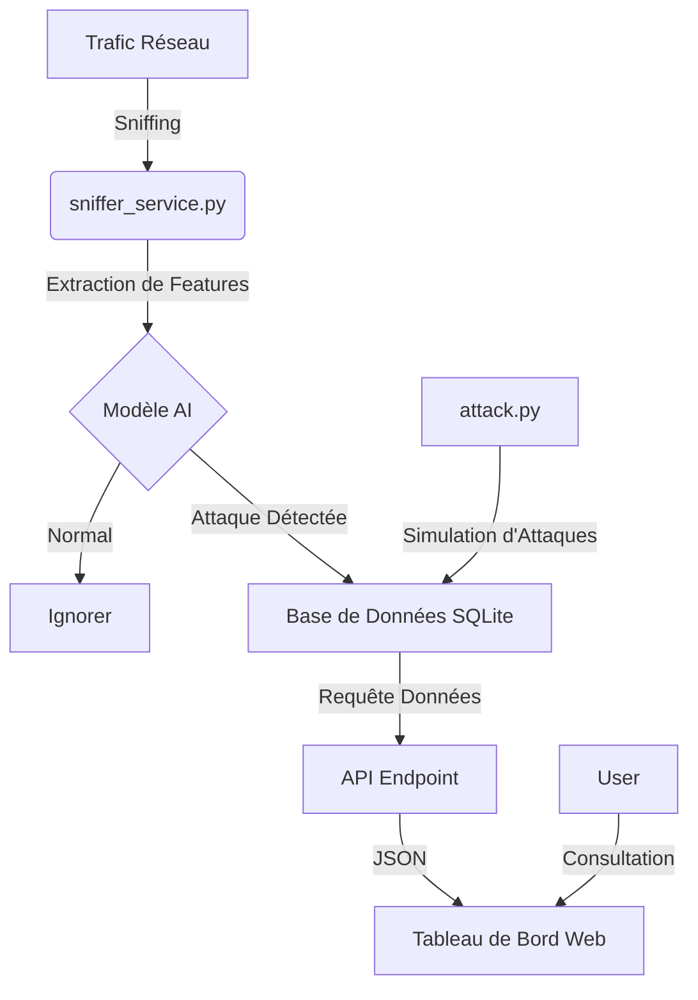

# Projet Phoenix : Analyse du Système de Détection d'Intrusions (IDS)

## 1. Vue d'ensemble
**Phoenix** (CyberGuard AI) est un système de détection d'intrusions intelligent (NIDS) conçu pour protéger les infrastructures réseau en utilisant le Machine Learning (XGBoost). Contrairement aux pare-feux traditionnels basés sur des signatures, Phoenix analyse le comportement du trafic en temps réel pour identifier des attaques sophistiquées comme les DDoS, scans de ports, botnets et attaques par force brute.

## 2. Architecture du Système
Le système repose sur une architecture modulaire en trois couches : **Détection**, **Stockage** et **Visualisation**.

## 3. Analyse des Composants Clés

### A. Moteur de Détection (`sniffer_service.py`)
Il s'agit du cœur du système qui tourne en arrière-plan.
- **Bibliothèque** : Utilise `scapy` pour la capture de paquets.
- **Processus** :
    1.  **Sniffing** : Capture des paquets TCP/UDP.
    2.  **Agrégation de Flux** : Regroupe les paquets en "flux" (IP Source, IP Dest, Port Source, Port Dest, Protocole).
    3.  **Extraction de Caractéristiques** : Calcule les métriques statistiques (Durée du flux, taille des paquets, temps inter-arrivée, flags...) pour correspondre au format du dataset **CICIDS2017**.
    4.  **Inférence** :
        - Normalisation des données via `scaler_final.pkl`.
        - Prédiction avec le modèle d'entraînement `xgboost_final.pkl`.
    5.  **Journalisation** : Si le trafic est malveillant, une alerte est enregistrée dans `ids_logs.db`.

### B. Le Cerveau (Modèles Machine Learning)
Le système utilise des fichiers sérialisés pré-entraînés :
- **`xgboost_final.pkl`** : Le classifieur XGBoost capable de distinguer le trafic bénin des différentes familles d'attaques.
- **`scaler_final.pkl`** : Le scaler standard pour normaliser les entrées.
- **`label_encoder_final.pkl`** : Décode la sortie numérique du modèle en noms d'attaques lisibles (ex: "DDoS", "PortScan").

### C. Backend & Visualisation (`web_app.py`)
- **Framework** : FastAPI (Python).
- **Fonctionnalités** :
    - Sert le tableau de bord HTML.
    - Fournit une API REST (`/api/data`) qui interroge la base SQLite pour récupérer les dernières alertes.
- **Interface** : Affiche des métriques en temps réel, un fil d'alertes en direct et des graphiques de distribution.

### D. Outil de Simulation (`attack.py`)
Script de test permettant de vérifier la réactivité du tableau de bord sans générer de réel trafic malveillant.
- Injecte directement de fausses entrées d'attaques dans la base de données pour simuler un scénario de menace active.

## 4. Flux de Données

### Flux de Détection Temps Réel
1.  Lancement de `sniffer_service.py`.
2.  Les paquets sont capturés et mis en tampon (buffer) pendant 3 secondes.
3.  Les caractéristiques (features) sont calculées et envoyées au modèle XGBoost.
4.  Les menaces détectées sont enregistrées en base de données.

### Flux de Surveillance (Dashboard)
1.  Lancement de `web_app.py`.
2.  Le JavaScript du frontend appelle périodiquement `/api/data`.
3.  Le tableau de bord met à jour le fil d'alertes et les graphiques instantanément.

## 5. Instructions de Déploiement
1.  **Installation des dépendances** : `pip install -r requirements.txt`
2.  **Démarrer la détection** : `python sniffer_service.py` (nécessite les droits root/sudo).
3.  **Démarrer le tableau de bord** : `python web_app.py`
4.  **Accès** : Ouvrir `http://localhost:8000`

## 6. Conclusion
Le projet Phoenix offre une base solide pour un outil SOC moderne, alliant la rapidité de Scapy pour l'analyse réseau à la précision de XGBoost pour la détection. Son architecture découplée permet une évolution facile (ex : passage à PostgreSQL ou séparation du serveur web).
